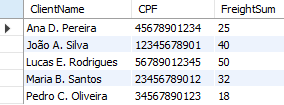
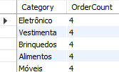
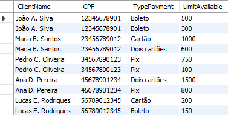
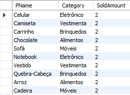
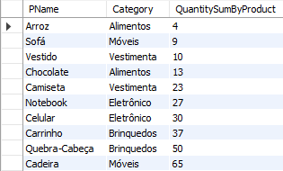
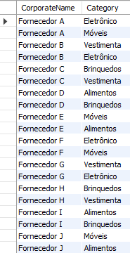
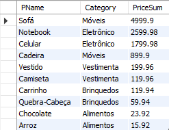

# Ecommerce - SQL - DIO challenge

## Proposta

Mapear um ER e, a partir deste, gerar o esquema SQL para a criação do BD. Realizar a inserção de valores e recuperar essas informações com queries DML pensadas para responder "perguntas".

1. Mapeamento do esquema ER para Relacional
2. Definição do script SQL para criação do esquema de banco de dados
3. Persistência de dados para testes
4. Recuperação de informações com queries SQL

## Diagrama EER

A imagem mostra um diagrama EER de um banco de dados que envolve as seguintes entidades: produtos, fornecedores, clientes, pedidos, pagamentos e vendedores. Cada entidade tem seus atributos listados abaixo do nome da entidade. Por exemplo, a entidade produtos tem os atributos *IdProduct*, *Pname*, *Classification_kids*, *Category*, *Rating*, *Size* e *Price*.

Os relacionamentos entre as entidades são representados por linhas que ligam as entidades. Cada relacionamento tem uma cardinalidade que indica quantas instâncias de cada entidade estão envolvidas no relacionamento. Por exemplo, o relacionamento entre a entidade *product* e a entidade *productOrder* e tem a cardinalidade 1:N, o que significa que um produto pode estar em vários pedidos, mas cada pedido só contem uma vez determidado produto.

Vale ressaltar que esse diagrama teve seus relacionamentos N:M expandidos em novas entidades para representar como as tabelas estarão no Banco de Dados, afim de aumentar a fidelidade ao Esquema SQL.

## Perguntas abordadas

- Quantos clientes temos?
    
    

- Quais pedidos foram feitos por quais clientes?

    

- Quanto cada cliente gastou com frete?

    

- Quantos pedidos foram realizados?

    

- Qual a quantidade de pedidos 'Em processamento' em contrapartida aos 'Confirmado's?

    

- Qual a quantidade de pedidos por Categoria de produto?

    

- Qual(is) a(s) forma(s) de pagamento mais usada(s)?

    

- Que tipo de pagamento cada cliente tem?

    

- Qual o Limite médio que cada cliente tem?

    

- Qual é o produto mais vendido?

    

- Qual o produto com menor quantidade nos estoques?

    

- Qual o produto com menor quantidade em determinado estoque?

    

- Qual a categoria de produto que cada fornecedor oferece?

    

- Quais os fornecedores de 'Eletrônico's?

    

- Quanto foi gasto com frete?

    

- Qual a receita total gerada?

    

- Qual a receita gerada por cada produto?

    

## Author

### Wanderson G. Fernandes
- [Instagram](https://instagram.com/locke._.wanderson?igshid=ZDc4ODBmNjlmNQ==)
- [LinkedIn](https://www.linkedin.com/in/wanderson-guedes-3138851aa)

## 📝 Licença

Esse projeto está sob licença MIT. Veja o arquivo [LICENÇA](LICENSE.md) para mais detalhes.
